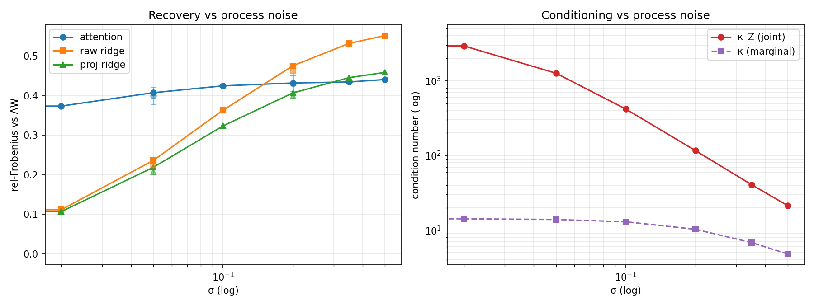

# 🧠 Research Report: Can Attention Recover Opinion Dynamics?

> **One-line thesis:** If a single attention head behaves like an opinion-dynamics operator, its learned attention map should reconstruct the true influence matrix — not just predict the next opinion.

| | |
|--|--|
| **Experiment design** | `opinion-attention-experiment.md` (draft v0.4) |
| **Execution plan** | `PLAN.md` |
| **Scope** | Rungs 0–4 (rung 5 deferred; rungs 6–7 out of scope) + Run #2 follow-ups |
| **Stack** | NumPy + PyTorch (CPU), N=50 agents, one fixed world per rung |

All numbers trace to `results/rung_*/metrics.json` (primary seed 0 unless noted). Re-run scripts live in `experiments/`.

---

## 📖 How to read the metrics

This section is for readers who have not lived inside the experiment design. Every table below uses these quantities.

### 🏆 The prize: did we recover the *structure*?

| Metric | What it is | How to read it |
|--------|------------|----------------|
| **Relative Frobenius error** \(\\|A - W\\|_F / \\|W\\|_F\) | Entrywise distance between the learned attention map \(A\) and the true influence matrix \(W\), scaled by the size of \(W\). | **0 = perfect recovery.** ≈0.02 is excellent; ≈0.2 is “in the ballpark under noise”; ≈0.4 is a clear miss on dense matrices. Primary metric on **dense** rungs (0–3). |
| **Spearman rank correlation** | Do larger entries of \(A\) line up with larger entries of \(W\), even if the absolute scale is off? | **+1 = perfect rank agreement**, 0 = no relationship, −1 = reversed. More robust than Frobenius when many true edges are near zero (sparse/clustered graphs). |
| **Top-\(k\) edge precision** | Of the \(k\) strongest predicted edges (where \(k\) = number of true edges), what fraction are real? | **1.0 = every predicted “important” edge exists in truth.** Primary (with Spearman) on **sparse/clustered** rung 4 — discovering *which* links exist matters more than exact weights. |
| **Stubbornness recovery** | Under Friedkin–Johnsen (FJ), each agent keeps weight \(1-\lambda_i\) on its innate opinion. We read that weight from the **anchor-token** diagonal of attention. | Report **MAE** (lower better) and **correlation** with true \(1-\lambda\) (**+1 = perfect**). Near-perfect here means the architecture’s stubbornness *readout* works, even if the social-influence block is imperfect. |

### 🎯 Can the model predict at all?

| Metric | What it is | How to read it |
|--------|------------|----------------|
| **Held-out prediction MSE** | Mean squared error of next-step opinions on trajectories the model never trained on. | Necessary but **not sufficient**. Low MSE with a *wrong* attention map is the failure mode we guard against (§3b): the model can predict without being interpretable. Always compare attention MSE to the **ridge baseline** on the same split. |

### 📐 Does the *data* even identify \(W\)?

| Metric | What it is | How to read it |
|--------|------------|----------------|
| **Ridge (raw)** | Unconstrained least-squares fit of the linear map \(x(t)\!\to\!x(t+1)\) (or the N×2N FJ operator). No neural net. | Sets the **recovery ceiling**. If ridge fails, the data is under-exciting — fix the dataset before blaming attention. |
| **Ridge (simplex-projected)** | Same fit, then each row is Euclidean-projected onto the probability simplex (non-negative, sums to 1) — the same constraint softmax attention obeys. | The **fair** comparator to attention. If attention only beats *raw* ridge, the “win” may just be the row-stochasticity constraint. |
| **κ (marginal)** | Condition number of \(\mathrm{cov}(x(t))\). | Large κ ⇒ some directions of state-space are barely visited. |
| **κ_Z (joint)** | Condition number of \(\mathrm{cov}([x(t);\, x(0)])\) — the features of the full FJ regression. | For FJ this is the one that matters. Run #1’s marginal κ≈14 looked fine while κ_Z was ~10³ because opinions stay near their anchors. |

### 🧭 Rule of thumb for tables below

1. **Compare attention to ridge on the same data** — never attention alone.
2. **Prediction MSE ≈ ridge MSE** means the dynamics are learnable; the prize is whether \(A\) matches \(W\).
3. **Dense worlds → trust relative Frobenius.** **Sparse/clustered → trust Spearman + top-\(k\)** (Frobenius has a positivity floor under softmax).

---

## 📊 Run #1 summary — primary metrics vs ridge

| Rung | Setting | Primary metric | Attention | Ridge (same data) | Held-out pred MSE (attn / ridge) | κ(cov X) |
|------|---------|----------------|-----------|-------------------|----------------------------------|----------|
| **0** ⚪ | Dense DeGroot, σ=0, ridge only | rel-Frobenius vs \(W\) | — | **5.92e-6** | 8.23e-14 / — | 68.5 |
| **1** 🟢 | Dense DeGroot, σ=0, single head | rel-Frobenius vs \(W\) | **0.0246** | 5.92e-6 | 1.32e-6 / 8.23e-14 | 68.5 |
| **2** 🟡 | + process noise σ=0.05 | rel-Frobenius vs \(W\) | **0.190** | 0.201 | 2.58e-3 / 2.59e-3 | 61.4 |
| **3** 🟠 | + FJ + 2N anchors (M=2000) | rel-Frobenius vs \(\Lambda W\) | **0.407** | 0.237 | 2.57e-3 / 2.49e-3 | 13.9 |
| **4** 🔵 | + clustered \(W\) | Spearman vs \(W\) / top-\(k\) | **0.602 / 0.808** | Spearman(\(\Lambda W\)) 0.625 | 2.58e-3 / 2.48e-3 | 13.6 |

🎁 **Secondary (rung 3 stubbornness):** \(\mathrm{diag}(A_{\mathrm{anc}})\) vs \((1-\lambda)\) — MAE **0.00646**, corr **0.9995** (near-perfect readout).

**Quick takeaway:** DeGroot recovery works; FJ recovers stubbornness but not the dense influence block at ridge quality; clustered graphs recover the *skeleton* of influence.

---

## 🗺️ Heatmaps (learned map vs ground truth)

Side-by-side: left = what the model (or ridge) learned; right = ground truth. Visually similar heatmaps ⇒ structure recovery.

### Rung 0 — ridge \(\hat W\) vs true \(W\)


### Rung 1 — attention \(A\) vs true \(W\) (DeGroot, noiseless)


### Rung 2 — attention \(A\) vs true \(W\) (DeGroot + noise)


### Rung 3 — attention current block vs \(\Lambda W\) (FJ + anchors)


### Rung 4 — attention current block vs clustered \(W\)


---

## ✅ What worked

1. **🚪 Data gate (rung 0).** With M=200 short trajectories from varied \(x(0)\), dense noiseless DeGroot is fully identifiable: ridge rel-Frobenius ≈ \(6\times10^{-6}\). Multi-trajectory excitation (§1b) is load-bearing; generator unit tests pass (row-stochastic \(W\); \(W^t\) dynamics; FJ closed form only when \(\lambda_i<1\)).

2. **🟢 DeGroot attention recovers structure (rung 1).** Identity-driven Q/K + raw-scalar V recovers \(W\) with Spearman ≈ 0.999 and rel-Frobenius ≈ 0.025 across 3 seeds. The interpretability claim holds in the cleanest setting.

3. **🟡 Noise does not break DeGroot recovery (rung 2).** At σ=0.05, attention **matches or slightly beats** ridge (0.190 vs 0.201) with tied prediction MSE. Softmax row-stochasticity behaves like helpful regularization under noisy targets. (Run #2 reconfirmed this against *projected* ridge.)

4. **⚓ Anchor-token stubbornness readout (rung 3).** \(\mathrm{diag}(A_{\mathrm{anc}})\) recovers \(1-\lambda\) with correlation ≈ 0.999. The architectural rhyme between FJ anchors and attention tokens is empirically real.

5. **🔵 Clustered structure discovery (rung 4).** Attention Spearman ≈ 0.60 ≈ ridge 0.62 and top-\(k\) edge precision ≈ 0.81–0.85. Influence *skeleton* is recoverable even when dense entrywise Frobenius is messy.

---

## ❌ What failed (and why we think it failed)

### Rung 1 residual vs ridge (mild)
Attention never reaches ridge’s numerical ceiling (0.025 vs \(6\times10^{-6}\)) under noiseless DeGroot.  
**Class:** optimization under softmax / bilinear ID parameterization — **not** data (ridge perfect) or capacity (\(d=N\) suffices). Prediction MSE already ~\(10^{-6}\). Not patched by adding \(W_V\)/MLP (forbidden; would muddle the prize metric).

### Rung 3 current-block recovery (main failure)
Attention \(\\|A_{\mathrm{cur}} - \Lambda W\\|_F / \\|\Lambda W\\|_F\) ≈ **0.41** vs ridge **0.24** (M=2000, σ=0.05, 3 seeds).  
**Class:** architecture + optimization, with a data contribution at small \(M\):

| Diagnostic | Ridge cur | Attn cur | Note |
|------------|-----------|----------|------|
| M=200, σ=0.05 | 0.83 | ~3.7 | data under-exciting → raised \(M\) |
| M=200, σ=0 | \(8\times10^{-4}\) | ~3.3 (bad init) / 0.53 (LBFGS+orth) | architecture/opt even when data is fine |
| M=2000, σ=0.05, Adam+orth | 0.24 | **0.41** | best noisy run; stub corr≈0.999 |

Anchors are easy; the dense \(\Lambda W\) block under a joint 2N-way softmax is hard. Joint \([x(t); x(0)]\) covariance is ill-conditioned (\(\kappa_Z \sim 10^3\)) because FJ keeps opinions near anchors — the loss landscape is flatter for splitting mass between current and anchor tokens when their values are similar. Prediction MSE nonetheless matches ridge, so the model can predict without recovering \(A_{\mathrm{cur}} \approx \Lambda W\).

### Rung 5 not attempted
Rung 3’s prize-metric gap means 0–4 did not all succeed cleanly. Multi-head would further split influence across heads before the single-head FJ map is solved.

---

## 🔒 Constraints compliance checklist

| Constraint | Status |
|------------|--------|
| Identity embeddings drive Q/K | ✅ |
| Raw-scalar V; no \(W_V\) / out-proj / MLP | ✅ |
| FJ = 2N anchor tokens, raw values | ✅ (rung 3+) |
| Token axis = agents | ✅ |
| Attention fully free (no graph mask) | ✅ |
| \(d \geq N = 50\) | ✅ |
| One world, \(M\) trajectories; raise \(M\) if ridge poor | ✅ (M→2000 at rung 3) |
| One change between rungs | ✅ |
| Never rungs 6–7 | ✅ |

---

## 🔬 Run #2 — corrections, σ-sweep, unrolling, factored diagnostic

Bookkeeping fixes + tests of the “flat landscape” hypothesis (FJ keeps \(x(t)\approx x(0)\), so attention can trade mass between current tokens and anchors with little prediction penalty). Primary metrics and success criteria were fixed **before** seeing results. All run-#1 hard constraints retained except Task 5 (labeled ablation).

### 📋 Summary table

| Task | Setting | Primary | Attention | Raw ridge | Proj ridge | Notes |
|------|---------|---------|-----------|-----------|------------|-------|
| **1** 🧹 | Hygiene | — | — | — | — | Diag configs fixed; Euclidean simplex proj + \(\kappa_Z\) helpers + tests |
| **2** 🔁 | Rung 2 redo, 3 seeds, σ=0.05 | rel-F vs \(W\) | **0.1877** (mean) | 0.1961 | **0.1901** | Claim vs *projected* ridge **CONFIRMED** |
| **3** 📈 | FJ σ-sweep, M=2000 (seed0 @ σ=0.05) | rel-F \(A_{\mathrm{cur}}\) vs \(\Lambda W\) | 0.407 | 0.237 | 0.219 | See sweep plot; \(\kappa_Z\) logged |
| **4** 🔄 | Unrolled k=1→2→4, σ=0.05 | rel-F \(A_{\mathrm{cur}}\) vs \(\Lambda W\) | **0.409** (mean) | ~0.22–0.24 | ~0.20–0.22 | **NO SUCCESS** vs one-step 0.40 |
| **5** 🧪 | Factored-logit **diag** (not headline) | rel-F \(A_{\mathrm{cur}}\) vs \(\Lambda W\) | **0.094** | 0.237 | 0.219 | Joint 2N-softmax was the bottleneck |

Task 2 per-seed (rel-F): attn [0.190, 0.189, 0.184]; raw ridge [0.201, 0.196, 0.192]; proj ridge [0.195, 0.190, 0.186].

### 📈 σ-sweep plot

Left: recovery (attention / raw ridge / projected ridge) vs process noise σ. Right: condition numbers vs σ. Both x-axes are log-scaled.



Seed-0 table (rel-F \(A_{\mathrm{cur}}\) vs \(\Lambda W\) / \(\kappa_Z\)):

| σ | attn | raw ridge | proj ridge | \(\kappa_Z\) | attn−ridge gap |
|---|------|-----------|------------|-----|----------------|
| 0 | 0.300 | 0.000 | 0.000 | 4037 | +0.300 |
| 0.02 | 0.373 | 0.112 | 0.107 | 2932 | +0.262 |
| 0.05 | 0.407 | 0.237 | 0.219 | 1262 | +0.171 |
| 0.1 | 0.425 | 0.363 | 0.324 | 419 | +0.061 |
| 0.2 | 0.432 | 0.475 | 0.407 | 116 | **−0.044** |
| 0.35 | 0.434 | 0.532 | 0.445 | 40 | −0.097 |
| 0.5 | 0.441 | 0.552 | 0.459 | 21 | −0.111 |

*Gap = attention rel-F − raw ridge rel-F. Negative ⇒ attention beats unconstrained ridge (usually via the softmax constraint helping under heavy noise).*

### 🧪 Verdicts on σ-sweep hypotheses (pre-registered)

1. **\(\kappa_Z\) falls as σ rises — ✅ SUPPORTED.** Spearman(σ, \(\kappa_Z\))=−1.0 (4037→21). Marginal κ alone (~14 in run #1) hid the N×2N pathology.
2. **Ridge \(\Lambda W\) recovery non-monotone with interior optimum — ❌ NOT SUPPORTED.** Best at σ=0; degrades monotonically at M=2000. “Some noise helps” (§1b) does not appear for this well-excited FJ operator fit — noise is mostly target corruption here. Negative result retained.
3. **Attention−ridge gap narrows as σ rises — ✅ SUPPORTED.** Spearman(σ, gap)=−1.0; gap turns negative by σ=0.2. Absolute attention recovery still plateaus ~0.43–0.44; the gap closes mainly because ridge worsens faster.

### 🔄 Unrolled-training success criterion

**Criterion (pre-registered):** mean unrolled rel-F improves on one-step ≈0.40 by > seed spread ≈0.05 (i.e. mean < 0.35); interesting if ≈ ridge 0.23; stub corr > 0.99.

**Result: ❌ NO SUCCESS.** Mean unrolled rel-F = **0.409** (seeds 0.424 / 0.391 / 0.414) — indistinguishable from one-step. Training stable (no NaN/explosion with curriculum + grad clip). Stubbornness corr stays ≈0.9998. Unrolling alone does not cure the joint-softmax / flat-landscape gap.

### 🧩 Factored-logit diagnostic (Task 5 — ablation, not headline)

> ⚠️ **Not a headline result.** Architecture ablation outside the locked run-#1 constraint set.

Factored gates + N-token softmax: rel-F(\(A_{\mathrm{cur}}\) vs \(\Lambda W\)) = **0.094**, Spearman 0.987, gate↔\((1-\lambda)\) corr ≈ 1.000 — **beats ridge (0.237)**. Interprets the run-#1/Task-4 failure: the gap was largely the *joint* 2N-way softmax coupling currents and anchors, not the bilinear ID map itself. Do not promote to headline without a new protocol decision.

---

## 🚧 Limitations and open questions

1. **Joint 2N-softmax is the FJ bottleneck (sharpened).** Task 5 shows a factored gate recovers \(\Lambda W\) better than ridge under the same data/constraints on V. Open: is a factored (or similarly structured) head an acceptable “single attention head” for the research claim, or a different operator class?
2. **Unrolling does not fix joint softmax (§4 graduation path tested).** Task 4 negative: multi-step self-rollout preserves prediction and stubbornness but not \(A_{\mathrm{cur}}\) quality.
3. **Noise helps the attention−ridge *gap*, not absolute recovery.** Absolute attn rel-F worsens mildly with σ; ridge worsens faster. Interior optimum for ridge recovery not observed at M=2000 dense FJ.
4. **Always log \(\kappa_Z\) for FJ.** Marginal κ is misleading; joint \([x(t); x(0)]\) conditioning is the right diagnostic.
5. **Fair ridge comparisons need simplex projection.** Task 2 confirmed attention still matches/beats projected ridge under DeGroot noise; raw-only comparisons overstate attention’s edge.
6. **Clustered / many-worlds / real data** — unchanged deferrals from run #1; rungs 5–7 not attempted.
7. **Small-\(d\) on clustered \(W\)** — left open per §7; not swept here.

---

## ▶️ Reproduce

### Run #2

```bash
PYTHONPATH=. pytest -q tests/
PYTHONPATH=. python experiments/rung_2_noise.py --extra-seeds 0,1,2
PYTHONPATH=. python experiments/rung_3_sigma_sweep.py
PYTHONPATH=. python experiments/rung_3_unrolled.py --extra-seeds 0,1,2
PYTHONPATH=. python experiments/rung_3_factored_diag.py  # diagnostic only
```

Artifacts: `results/rung_2/`, `results/rung_3_sigma_sweep/`, `results/rung_3_unrolled/`, `results/rung_3_factored_diag/`.

### Run #1

```bash
pip install -r requirements.txt
PYTHONPATH=. pytest -q tests/
PYTHONPATH=. python experiments/rung_0_ridge.py
PYTHONPATH=. python experiments/rung_1_degroot.py --extra-seeds 0,1,2 --epochs 800 --lr 5e-3
PYTHONPATH=. python experiments/rung_2_noise.py --extra-seeds 0,1,2
PYTHONPATH=. python experiments/rung_3_fj.py --M 2000 --epochs 800 --lr 5e-3 --sigma 0.05 --extra-seeds 0,1,2
PYTHONPATH=. python experiments/rung_4_clustered.py --M 2000 --epochs 800 --lr 5e-3 --extra-seeds 0,1,2
```

---

*Written for skeptical reproduction. Negative and partial results are first-class outcomes. Hypothesis (ii) and Task 4 are explicit negatives.* ✍️
