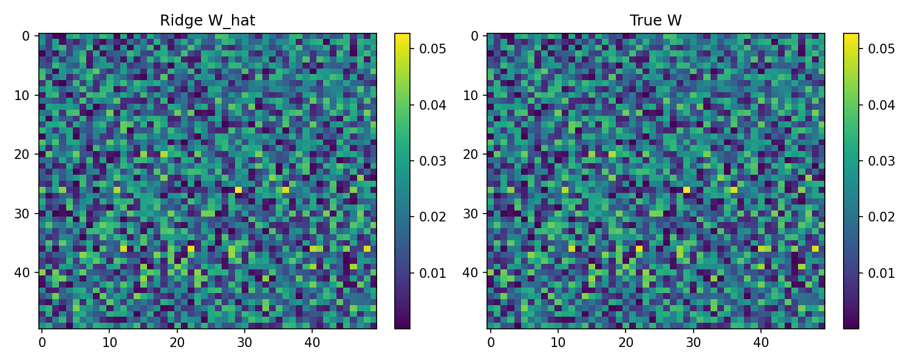
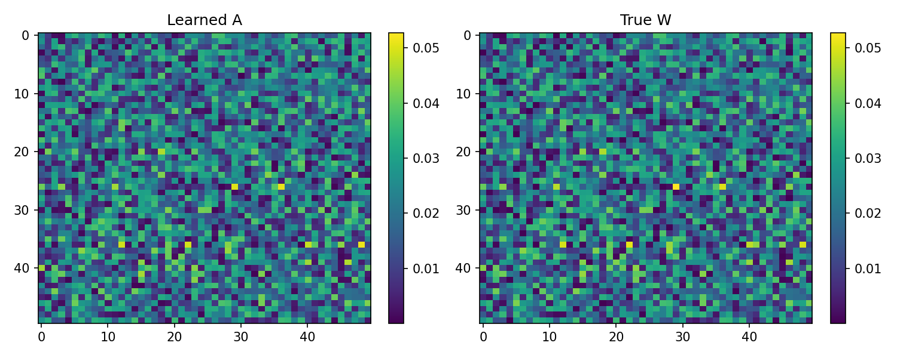
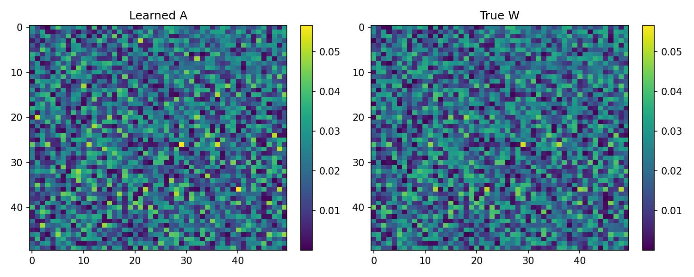
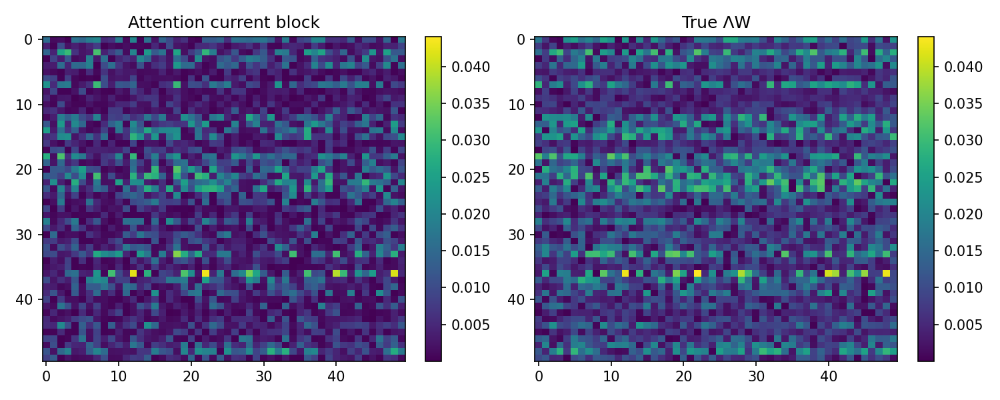
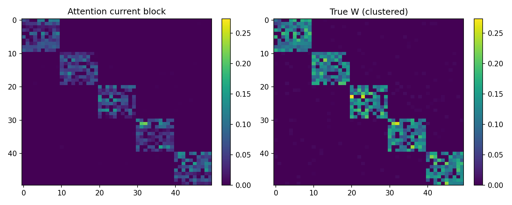

# Research Report: Can Attention Recover Opinion Dynamics?

**Experiment design:** `opinion-attention-experiment.md` (draft v0.4)  
**Execution plan:** `PLAN.md`  
**Scope executed:** rungs 0–4 (rung 5 deferred; rungs 6–7 out of scope)  
**Stack:** NumPy + PyTorch (CPU), N=50, single fixed world per rung, one-step teacher-forced MSE  

All numbers below are taken from `results/rung_*/metrics.json` (primary seed 0 unless noted). Re-run scripts live in `experiments/`.

---

## Summary table — primary metrics vs ridge

| Rung | Setting | Primary metric | Attention | Ridge (same data) | Held-out pred MSE (attn / ridge) | κ(cov X) |
|------|---------|----------------|-----------|-------------------|----------------------------------|----------|
| **0** | Dense DeGroot, σ=0, ridge only | rel-Frobenius vs W | — | **5.92e-6** | 8.23e-14 / — | 68.5 |
| **1** | Dense DeGroot, σ=0, single head | rel-Frobenius vs W | **0.0246** | 5.92e-6 | 1.32e-6 / 8.23e-14 | 68.5 |
| **2** | + process noise σ=0.05 | rel-Frobenius vs W | **0.190** | 0.201 | 2.58e-3 / 2.59e-3 | 61.4 |
| **3** | + FJ + 2N anchors (M=2000) | rel-Frobenius vs ΛW | **0.407** | 0.237 | 2.57e-3 / 2.49e-3 | 13.9 |
| **4** | + clustered W | Spearman vs W / top-k | **0.602 / 0.808** | Spearman(ΛW) 0.625 | 2.58e-3 / 2.48e-3 | 13.6 |

Secondary (rung 3 stubbornness): diag(A_anc) vs (1−λ) — MAE **0.00646**, corr **0.9995**.

---

## Heatmaps (learned map vs ground truth)

### Rung 0 — ridge Ŵ vs true W


### Rung 1 — attention A vs true W (DeGroot, noiseless)


### Rung 2 — attention A vs true W (DeGroot + noise)


### Rung 3 — attention current block vs ΛW (FJ + anchors)


### Rung 4 — attention current block vs clustered W


---

## What worked

1. **Data gate (rung 0).** With M=200 short trajectories from varied x(0), dense noiseless DeGroot is fully identifiable: ridge rel-Frobenius ≈ 6×10⁻⁶. Multi-trajectory excitation (§1b) is load-bearing; the generator unit tests pass (row-stochastic W; Wᵗ dynamics; FJ closed form only when λᵢ<1).

2. **DeGroot attention recovers structure (rung 1).** Identity-driven Q/K + raw-scalar V recovers W with Spearman ≈ 0.999 and rel-Frobenius ≈ 0.025 across 3 seeds. The interpretability claim holds in the cleanest setting.

3. **Noise does not break DeGroot recovery (rung 2).** At σ=0.05, attention **matches or slightly beats** ridge (0.190 vs 0.201) with tied prediction MSE. Softmax row-stochasticity behaves like helpful regularization under noisy targets.

4. **Anchor-token stubbornness readout (rung 3).** diag(A_anc) recovers (1−λ) with correlation ≈ 0.999. The architectural rhyme between FJ anchors and attention tokens is empirically real.

5. **Clustered structure discovery (rung 4).** On the §5 primary metrics, attention Spearman ≈ 0.60 ≈ ridge 0.62 and top-k edge precision ≈ 0.81–0.85. Influence *skeleton* is recoverable even when dense entrywise Frobenius is messy.

---

## What failed (and why we think it failed)

### Rung 1 residual vs ridge (mild)
Attention never reaches ridge’s numerical ceiling (0.025 vs 6×10⁻⁶) under noiseless DeGroot.  
**Class:** optimization under softmax / bilinear ID parameterization — **not** data (ridge perfect) or capacity (d=N suffices). Prediction MSE already ~10⁻⁶. Not patched by adding W_V/MLP (forbidden; would muddle the prize metric).

### Rung 3 current-block recovery (main failure)
Attention ||A_cur − ΛW||_F / ||ΛW||_F ≈ **0.41** vs ridge **0.24** (M=2000, σ=0.05, 3 seeds).  
**Class:** architecture + optimization, with a data contribution at small M:

| Diagnostic | Ridge cur | Attn cur | Note |
|------------|-----------|----------|------|
| M=200, σ=0.05 | 0.83 | ~3.7 | data under-exciting → raised M |
| M=200, σ=0 | 8×10⁻⁴ | ~3.3 (bad init) / 0.53 (LBFGS+orth) | architecture/opt even when data is fine |
| M=2000, σ=0.05, Adam+orth | 0.24 | **0.41** | best noisy run; stub corr≈0.999 |

Anchors are easy; the dense ΛW block under a joint 2N-way softmax is hard. Joint [x(t); x(0)] covariance is ill-conditioned (κ_Z ~10³) because FJ keeps opinions near anchors — loss landscape is flatter for splitting mass between current and anchor tokens when their values are similar. Prediction MSE nonetheless matches ridge, so the model can predict without recovering A_cur ≈ ΛW — exactly the failure mode §3b warns about if the value path is unconstrained; here V is constrained and the failure is in the softmax factorization itself.

### Rung 5 not attempted
Rung 3’s prize-metric gap means 0–4 did not all succeed cleanly. Multi-head would further split influence across heads before the single-head FJ map is solved.

---

## Constraints compliance checklist

| Constraint | Status |
|------------|--------|
| Identity embeddings drive Q/K | Yes |
| Raw-scalar V; no W_V / out-proj / MLP | Yes |
| FJ = 2N anchor tokens, raw values | Yes (rung 3+) |
| Token axis = agents | Yes |
| Attention fully free (no graph mask) | Yes |
| d ≥ N = 50 | Yes |
| One world, M trajectories; raise M if ridge poor | Yes (M→2000 at rung 3) |
| One change between rungs | Yes |
| Never rungs 6–7 | Yes |

---

## Limitations and open questions

1. **Softmax factorization of [ΛW | I−Λ].** Can a single ID-keyed head reach ridge-level A_cur recovery under FJ, or is an architectural variant required that still preserves raw V (e.g. factored current/anchor logits, not a learned value path)?

2. **Identifiability when x≈x0.** Teacher-forced one-step MSE under strong anchoring may under-penalize wrong current/anchor splits. Would unroll-to-steady-state training (§4 graduation path) sharpen the map?

3. **M and σ schedule.** Dense FJ+noise needed M=2000 for usable ridge; DeGroot was fine at M=200. Adaptive M should be treated as part of the protocol, not an afterthought.

4. **Clustered collinearity ceiling.** Even ridge Spearman tops out near ~0.63 on our clustered graphs — entrywise recovery has a data limit; top-k is the honest prize for rung 4+.

5. **Small-d on clustered W.** Left open per §7; not swept here.

6. **Many-worlds / real data (rungs 6–7).** Explicitly deferred. Fixed ID embeddings cannot span worlds; amortized inference is a different experiment.

7. **Reproducibility notes.** Seeds logged in each `config.json`. Rung 3 diagnostics live in `results/rung_3_diag_*`. Generator tests: `pytest tests/test_generator.py`.

---

## Reproduce

```bash
pip install -r requirements.txt
PYTHONPATH=. pytest -q tests/
PYTHONPATH=. python experiments/rung_0_ridge.py
PYTHONPATH=. python experiments/rung_1_degroot.py --extra-seeds 0,1,2 --epochs 800 --lr 5e-3
PYTHONPATH=. python experiments/rung_2_noise.py --epochs 800 --lr 5e-3 --sigma 0.05
PYTHONPATH=. python experiments/rung_3_fj.py --M 2000 --epochs 800 --lr 5e-3 --sigma 0.05 --extra-seeds 0,1,2
PYTHONPATH=. python experiments/rung_4_clustered.py --M 2000 --epochs 800 --lr 5e-3 --extra-seeds 0,1,2
```

---

*Written for skeptical reproduction. Negative and partial results are first-class outcomes.*
