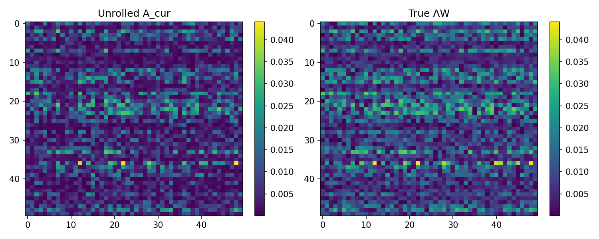
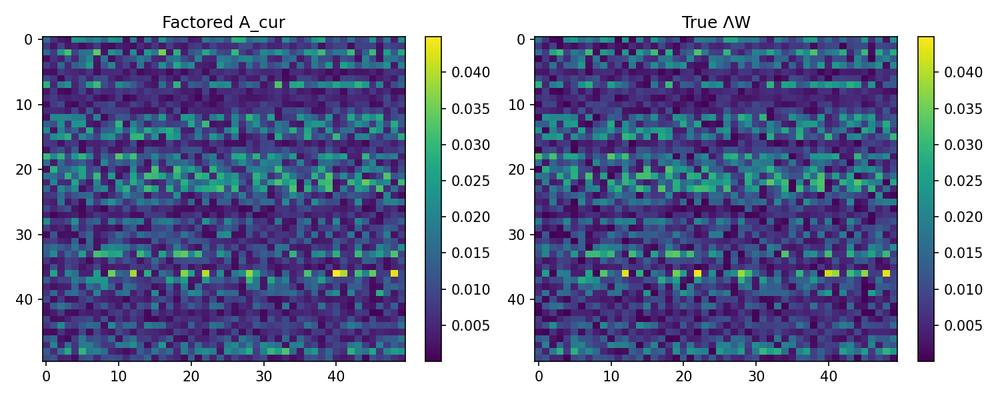

# 🧠 Research Report: Can Attention Recover Opinion Dynamics?

> **One-line thesis:** If a single attention head behaves like an opinion-dynamics operator, its learned attention map should reconstruct the true influence matrix — not just predict the next opinion.

| | |
|--|--|
| **Experiment design** | `opinion-attention-experiment.md` (draft v0.4) |
| **Execution plan** | `PLAN.md` |
| **Scope** | Rungs 0–4 (rung 5 deferred; rungs 6–7 out of scope) + Run #2 follow-ups |
| **Stack** | NumPy + PyTorch (CPU), N=50 agents, one fixed world per rung |

All numbers trace to `results/rung_*/metrics.json` (primary seed 0 unless noted). Re-run scripts live in `experiments/`.

---

## 📖 How to read the metrics

This section is for readers who have not lived inside the experiment design. Every table below uses these quantities.

### 🏆 The prize: did we recover the *structure*?

| Metric | What it is | How to read it |
|--------|------------|----------------|
| **Relative Frobenius error** \(\\|A - W\\|_F / \\|W\\|_F\) | Entrywise distance between the learned attention map \(A\) and the true influence matrix \(W\), scaled by the size of \(W\). | **0 = perfect recovery.** ≈0.02 is excellent; ≈0.2 is “in the ballpark under noise”; ≈0.4 is a clear miss on dense matrices. Primary metric on **dense** rungs (0–3). |
| **Spearman rank correlation** | Do larger entries of \(A\) line up with larger entries of \(W\), even if the absolute scale is off? | **+1 = perfect rank agreement**, 0 = no relationship, −1 = reversed. More robust than Frobenius when many true edges are near zero (sparse/clustered graphs). |
| **Top-\(k\) edge precision** | Of the \(k\) strongest predicted edges (where \(k\) = number of true edges), what fraction are real? | **1.0 = every predicted “important” edge exists in truth.** Primary (with Spearman) on **sparse/clustered** rung 4 — discovering *which* links exist matters more than exact weights. |
| **Stubbornness recovery** | Under Friedkin–Johnsen (FJ), each agent keeps weight \(1-\lambda_i\) on its innate opinion. We read that weight from the **anchor-token** diagonal of attention. | Report **MAE** (lower better) and **correlation** with true \(1-\lambda\) (**+1 = perfect**). Near-perfect here means the architecture’s stubbornness *readout* works, even if the social-influence block is imperfect. |

### 🎯 Can the model predict at all?

| Metric | What it is | How to read it |
|--------|------------|----------------|
| **Held-out prediction MSE** | Mean squared error of next-step opinions on trajectories the model never trained on. | Necessary but **not sufficient**. Low MSE with a *wrong* attention map is the failure mode we guard against (§3b): the model can predict without being interpretable. Always compare attention MSE to the **ridge baseline** on the same split. |

### 📐 Does the *data* even identify \(W\)?

| Metric | What it is | How to read it |
|--------|------------|----------------|
| **Ridge (raw)** | Unconstrained least-squares fit of the linear map \(x(t)\!\to\!x(t+1)\) (or the N×2N FJ operator). No neural net. | Sets the **recovery ceiling**. If ridge fails, the data is under-exciting — fix the dataset before blaming attention. |
| **Ridge (simplex-projected)** | Same fit, then each row is Euclidean-projected onto the probability simplex (non-negative, sums to 1) — the same constraint softmax attention obeys. | The **fair** comparator to attention. If attention only beats *raw* ridge, the “win” may just be the row-stochasticity constraint. |
| **κ (marginal)** | Condition number of \(\mathrm{cov}(x(t))\). | Large κ ⇒ some directions of state-space are barely visited. |
| **κ_Z (joint)** | Condition number of \(\mathrm{cov}([x(t);\, x(0)])\) — the features of the full FJ regression. | For FJ this is the one that matters. Run #1’s marginal κ≈14 looked fine while κ_Z was ~10³ because opinions stay near their anchors. |

### 🧭 Rule of thumb for tables below

1. **Compare attention to ridge on the same data** — never attention alone.
2. **Prediction MSE ≈ ridge MSE** means the dynamics are learnable; the prize is whether \(A\) matches \(W\).
3. **Dense worlds → trust relative Frobenius.** **Sparse/clustered → trust Spearman + top-\(k\)** (Frobenius has a positivity floor under softmax).

---

## 📊 Run #1 summary — primary metrics vs ridge

| Rung | Setting | Primary metric | Attention | Ridge (same data) | Held-out pred MSE (attn / ridge) | κ(cov X) |
|------|---------|----------------|-----------|-------------------|----------------------------------|----------|
| **0** ⚪ | Dense DeGroot, σ=0, ridge only | rel-Frobenius vs \(W\) | — | **5.92e-6** | 8.23e-14 / — | 68.5 |
| **1** 🟢 | Dense DeGroot, σ=0, single head | rel-Frobenius vs \(W\) | **0.0246** | 5.92e-6 | 1.32e-6 / 8.23e-14 | 68.5 |
| **2** 🟡 | + process noise σ=0.05 | rel-Frobenius vs \(W\) | **0.190** | 0.201 | 2.58e-3 / 2.59e-3 | 61.4 |
| **3** 🟠 | + FJ + 2N anchors (M=2000) | rel-Frobenius vs \(\Lambda W\) | **0.407** | 0.237 | 2.57e-3 / 2.49e-3 | 13.9 |
| **4** 🔵 | + clustered \(W\) | Spearman vs \(W\) / top-\(k\) | **0.602 / 0.808** | Spearman(\(\Lambda W\)) 0.625 | 2.58e-3 / 2.48e-3 | 13.6 |

🎁 **Secondary (rung 3 stubbornness):** \(\mathrm{diag}(A_{\mathrm{anc}})\) vs \((1-\lambda)\) — MAE **0.00646**, corr **0.9995** (near-perfect readout).

**Quick takeaway:** DeGroot recovery works; FJ recovers stubbornness but not the dense influence block at ridge quality; clustered graphs recover the *skeleton* of influence.

---

## 🗺️ Experiments — heatmaps with setup & interpretation

Each figure is a side-by-side heatmap: **left = learned map**, **right = ground truth**. Visually matching patterns mean the method recovered who influences whom (the prize), not merely that next-step prediction worked.

---

### ⚪ Rung 0 — Ridge baseline (no neural net)

**What we ran.** Before training any attention head, fit the influence matrix by ridge regression on consecutive opinion pairs \((x(t), x(t+1))\) from a dense DeGroot world (\(\Lambda = I\), no stubbornness, \(\sigma=0\)). Setup: \(N=50\) agents, \(M=200\) short trajectories (\(T=12\)) from varied random \(x(0)\), same fixed \(W\). This is the **data gate**: if unconstrained least squares cannot recover \(W\), no attention head can either.


**How to read the figure.** Left is ridge \(\hat W\); right is true \(W\). They are visually indistinguishable — every row of influence weights lines up.

**Interpretation.** Rel-Frobenius ≈ \(6\times10^{-6}\), Spearman ≈ 1.0, held-out MSE ≈ \(10^{-13}\), \(\kappa(\mathrm{cov}\,X)\approx 69\) (healthy). **Verdict: PASS.** The multi-trajectory design supplies enough excitation; the ladder may proceed. Any later attention failure is architecture/optimization, not missing information.

---

### 🟢 Rung 1 — DeGroot, dense \(W\), no noise, single attention head

**What we ran.** Exactly the rung-0 world, but now train a **single** attention head: learnable per-agent identity embeddings drive Q/K; values are the **raw scalar opinions** (no \(W_V\), no output projection, no MLP); attention is fully free (never masked to the true graph); \(d=N=50\). Train one-step teacher-forced MSE for 800 epochs; report across seeds \(\{0,1,2\}\).


**How to read the figure.** Left is the learned softmax attention map \(A\); right is true \(W\). The two panels share the same overall texture — bright/dark cells align — so the head recovered the influence structure, not a scrambled surrogate.

**Interpretation.** Attention rel-Frobenius ≈ **0.025**, Spearman ≈ **0.999**, prediction MSE ≈ \(10^{-6}\). Ridge on the same data is essentially perfect (rel-F ≈ \(6\times10^{-6}\)). So structure recovery **succeeds** for the research question, but attention does not hit ridge’s numerical ceiling — a stable ~2–3% residual across seeds from softmax + bilinear ID parameterization (not data or capacity). **Verdict: solid pass** on interpretability; mild optimization gap vs unconstrained OLS, reported not patched.

---

### 🟡 Rung 2 — Same DeGroot setup + process noise

**What we ran.** Change exactly one thing vs rung 1: inject Gaussian process noise \(\sigma=0.05\) into the FJ/DeGroot update while simulating. Architecture and training recipe unchanged. Run #2 re-ran this with **3 seeds** and compared attention to both **raw** ridge and **simplex-projected** ridge (the fair row-stochastic comparator).


**How to read the figure.** Same layout as rung 1, but both panels look slightly “softer” / noisier because the regression targets are corrupted. Structure is still visible: corresponding cells light up together, though absolute match is weaker than the noiseless case.

**Interpretation.** Mean attention rel-F **0.188** ≤ mean projected-ridge **0.190** ≤ raw ridge **0.196** (3 seeds). Prediction MSE is essentially tied (~\(2.58\times10^{-3}\)). Noise raises the recovery floor for everyone, but softmax’s built-in row-stochasticity acts like helpful regularization — attention **matches or slightly beats** the fair ridge baseline. **Verdict: CONFIRMED** (run #2 decision rule). The “attention beats ridge under noise” claim survives the projected-ridge check.

---

### 🟠 Rung 3 — Friedkin–Johnsen + 2N anchor tokens

**What we ran.** Turn on stubbornness (\(\Lambda \neq I\)): each agent partially anchors to its innate opinion \(x_i(0)\). Represent that with **\(2N\) tokens** per forward pass — \(N\) current opinions + \(N\) anchor tokens — raw-scalar values for both. Agent \(i\)’s attention row should put \(\lambda_i W_{ij}\) on current tokens and \(1-\lambda_i\) on its **own** anchor. Kept \(\sigma=0.05\); raised \(M\) to **2000** after ridge failed at \(M=200\). Primary metric: rel-Frobenius of the **current block** \(A_{\mathrm{cur}}\) vs \(\Lambda W\) (not vs \(W\) alone).


**How to read the figure.** Left = attention’s current-token block; right = true \(\Lambda W\). Unlike rungs 0–2, these panels do **not** match closely — the learned block is spikier / differently textured than the smooth dense \(\Lambda W\). That visual mismatch is the main failure of the ladder.

**Interpretation.** Attention rel-F vs \(\Lambda W\) ≈ **0.41** vs ridge ≈ **0.24** (3 seeds); Spearman ≈ 0.76. Yet **stubbornness works**: \(\mathrm{diag}(A_{\mathrm{anc}})\) vs \(1-\lambda\) has corr ≈ **0.9995**, MAE ≈ 0.006. Prediction MSE still matches ridge (~\(2.57\times10^{-3}\)). So the model predicts well and reads stubbornness correctly, but does **not** recover the social-influence block at ridge quality — classic “good prediction, weak interpretability” under a joint 2N-way softmax when \(x(t)\approx x(0)\). **Verdict: partial success / documented failure** on the prize metric; carried forward as the open problem. (Run #2 later showed a *factored* ablation closes this gap — see below — but that is outside the locked single-softmax architecture.)

---

### 🔵 Rung 4 — Clustered / sparse influence graph

**What we ran.** Keep FJ + anchors + \(\sigma=0.05\), \(M=2000\); change only the graph: **5 clusters** with strong within-cluster and weak between-cluster edges (more realistic, harder ID because agents in a cluster have collinear trajectories). Switch primary metrics per §5 to **Spearman + top-\(k\) edge precision** — Frobenius is secondary because softmax cannot put exact zeros on missing edges.


**How to read the figure.** Right (true \(W\)) shows block-diagonal cluster structure — bright squares along the diagonal blocks, dark elsewhere. Left (attention current block) should recover those blocks even if individual edge weights are mushy. Look for matching block outlines more than pixel-perfect intensities.

**Interpretation.** Spearman vs \(W\) ≈ **0.60** (ridge Spearman vs \(\Lambda W\) ≈ 0.63); top-\(k\) precision ≈ **0.81–0.85**. Attention discovers which edges exist nearly as well as ridge. Both methods’ Spearman plateaus ~0.60–0.64 — a **data** ceiling from within-cluster collinearity, not an attention-specific failure. Stubbornness MAE remains low (~0.008). **Verdict: PASS** on the named sparse primaries; influence *skeleton* is recoverable. Dense Frobenius caveats from rung 3 still apply but do not dominate this stress test.

---

## ✅ What worked (compressed)

1. **🚪 Rung 0** — data identifies dense DeGroot \(W\).
2. **🟢 Rung 1** — identity attention recovers \(W\) (Spearman ≈ 0.999).
3. **🟡 Rung 2** — noise does not break DeGroot recovery; attention ≥ projected ridge.
4. **⚓ Rung 3 stubbornness** — anchor diagonal tracks \(1-\lambda\) (corr ≈ 0.999).
5. **🔵 Rung 4** — clustered skeleton recovery competitive with ridge (top-\(k\) ≈ 0.81–0.85).

## ❌ What failed (compressed)

1. **Rung 1 mild gap** — attn rel-F ≈ 0.025 vs ridge ≈ 0; optimization under softmax, not data/capacity.
2. **Rung 3 main failure** — \(A_{\mathrm{cur}}\) vs \(\Lambda W\) ≈ 0.41 vs ridge ≈ 0.24; joint 2N-softmax + flat landscape when \(x\approx x(0)\).
3. **Rung 5 skipped** — FJ prize metric not clean enough to add multi-head muddiness.

---

## 🔒 Constraints compliance checklist

| Constraint | Status |
|------------|--------|
| Identity embeddings drive Q/K | ✅ |
| Raw-scalar V; no \(W_V\) / out-proj / MLP | ✅ |
| FJ = 2N anchor tokens, raw values | ✅ (rung 3+) |
| Token axis = agents | ✅ |
| Attention fully free (no graph mask) | ✅ |
| \(d \geq N = 50\) | ✅ |
| One world, \(M\) trajectories; raise \(M\) if ridge poor | ✅ (M→2000 at rung 3) |
| One change between rungs | ✅ |
| Never rungs 6–7 | ✅ |

---

## 🔬 Run #2 — corrections, σ-sweep, unrolling, factored diagnostic

Bookkeeping fixes + tests of the “flat landscape” hypothesis (FJ keeps \(x(t)\approx x(0)\), so attention can trade mass between current tokens and anchors with little prediction penalty). Primary metrics and success criteria were fixed **before** seeing results. All run-#1 hard constraints retained except Task 5 (labeled ablation).

### 📋 Summary table

| Task | Setting | Primary | Attention | Raw ridge | Proj ridge | Notes |
|------|---------|---------|-----------|-----------|------------|-------|
| **1** 🧹 | Hygiene | — | — | — | — | Diag configs fixed; Euclidean simplex proj + \(\kappa_Z\) helpers + tests |
| **2** 🔁 | Rung 2 redo, 3 seeds, σ=0.05 | rel-F vs \(W\) | **0.1877** (mean) | 0.1961 | **0.1901** | Claim vs *projected* ridge **CONFIRMED** |
| **3** 📈 | FJ σ-sweep, M=2000 (seed0 @ σ=0.05) | rel-F \(A_{\mathrm{cur}}\) vs \(\Lambda W\) | 0.407 | 0.237 | 0.219 | See sweep plot; \(\kappa_Z\) logged |
| **4** 🔄 | Unrolled k=1→2→4, σ=0.05 | rel-F \(A_{\mathrm{cur}}\) vs \(\Lambda W\) | **0.409** (mean) | ~0.22–0.24 | ~0.20–0.22 | **NO SUCCESS** vs one-step 0.40 |
| **5** 🧪 | Factored-logit **diag** (not headline) | rel-F \(A_{\mathrm{cur}}\) vs \(\Lambda W\) | **0.094** | 0.237 | 0.219 | Joint 2N-softmax was the bottleneck |

Task 2 per-seed (rel-F): attn [0.190, 0.189, 0.184]; raw ridge [0.201, 0.196, 0.192]; proj ridge [0.195, 0.190, 0.186].

### 📈 Task 3 — FJ σ-sweep (noise-robustness stress test)

**What we ran.** Freeze the rung-3 recipe (dense FJ, 2N anchors, \(M=2000\), \(d=50\), Adam, orthogonal init) and vary **only** process noise \(\sigma \in \{0, 0.02, 0.05, 0.1, 0.2, 0.35, 0.5\}\). Seed 0 at every σ; seeds \(\{0,1,2\}\) at σ∈\{0.05, 0.2\}. Pre-registered hypotheses: (i) \(\kappa_Z\) falls as σ rises; (ii) ridge recovery has an interior optimum in σ; (iii) the attention−ridge gap narrows as σ rises.


**How to read the figure.** **Left panel:** relative Frobenius vs \(\Lambda W\) for attention (circles), raw ridge (squares), and simplex-projected ridge (triangles) against σ on a log-x axis — lower is better recovery. **Right panel:** joint \(\kappa_Z\) (solid) and marginal \(\kappa\) (dashed) on log-y — lower means better-conditioned features for the N×2N regression.

**Interpretation.**

| Hypothesis | Verdict | What the plot shows |
|------------|---------|---------------------|
| (i) \(\kappa_Z\) ↓ with σ | ✅ SUPPORTED | Right panel: \(\kappa_Z\) falls 4037→21 (Spearman −1.0). Marginal \(\kappa\) barely moves — run #1’s “κ≈14 looks fine” hid the real pathology. |
| (ii) ridge interior optimum | ❌ NOT SUPPORTED | Left panel: ridge is **best at σ=0** and worsens monotonically. At this \(M\), noise is mostly target corruption, not helpful excitation. |
| (iii) attn−ridge gap narrows | ✅ SUPPORTED | Left panel: attention stays ~0.30–0.44 while ridge climbs past it; gap turns **negative** by σ=0.2 (attention beats raw ridge). Absolute attention recovery still plateaus — the gap closes mainly because ridge degrades faster. |

Seed-0 numbers:

| σ | attn | raw ridge | proj ridge | \(\kappa_Z\) | attn−ridge gap |
|---|------|-----------|------------|-----|----------------|
| 0 | 0.300 | 0.000 | 0.000 | 4037 | +0.300 |
| 0.02 | 0.373 | 0.112 | 0.107 | 2932 | +0.262 |
| 0.05 | 0.407 | 0.237 | 0.219 | 1262 | +0.171 |
| 0.1 | 0.425 | 0.363 | 0.324 | 419 | +0.061 |
| 0.2 | 0.432 | 0.475 | 0.407 | 116 | **−0.044** |
| 0.35 | 0.434 | 0.532 | 0.445 | 40 | −0.097 |
| 0.5 | 0.441 | 0.552 | 0.459 | 21 | −0.111 |

*Gap = attention rel-F − raw ridge rel-F. Negative ⇒ attention beats unconstrained ridge.*

---

### 🔄 Task 4 — Unrolled (multi-step) training on FJ

**What we ran.** Same rung-3 world (σ=0.05, \(M=2000\)), but train with the §4 **graduation path**: feed true \(x(t)\), roll the model \(k\) steps on its **own** predictions (anchors stay fixed at true \(x(0)\)), average MSE against stored \(x(t+1)\ldots x(t+k)\). Curriculum \(k=1\) (300 ep) → \(k=2\) → \(k=4\), grad clip 1.0, seeds \(\{0,1,2\}\). Success criterion fixed first: mean rel-F must beat one-step ≈0.40 by >0.05 (i.e. mean < 0.35); stub corr must stay >0.99.



**How to read the figure.** Same as rung 3: left = unrolled-trained \(A_{\mathrm{cur}}\), right = true \(\Lambda W\). If unrolling cured the flat landscape, the left panel should look much closer to the right than rung 3’s heatmap did.

**Interpretation.** It does **not**. Mean unrolled rel-F = **0.409** (seeds 0.424 / 0.391 / 0.414) — indistinguishable from one-step 0.40. Stubbornness corr stays ≈0.9998; training was stable (no NaN/explosion). **Verdict: ❌ NO SUCCESS.** Multi-step self-rollout preserves prediction and stubbornness but does not improve \(A_{\mathrm{cur}}\) quality. The flat current-vs-anchor directions are not cured by unrolling alone under the joint 2N-softmax.

---

### 🧩 Task 5 — Factored-logit diagnostic (ablation, not headline)

> ⚠️ **Not a headline result.** Architecture ablation outside the locked run-#1 “single joint softmax over 2N tokens” constraint.

**What we ran.** Same data as rung 3 (σ=0.05, \(M=2000\), seed 0), but factor each agent’s row: a learned gate \(g_i \approx 1-\lambda_i\) puts mass on the own anchor; the remaining \((1-g_i)\) is a softmax over the **\(N\) current tokens only** (identity Q/K as before). Values still raw scalars. Question: if this recovers \(\Lambda W\) near ridge, the rung-3 gap was the *joint* 2N-softmax; if not, the bilinear ID map itself is the bottleneck.



**How to read the figure.** Left = factored \(A_{\mathrm{cur}}\); right = true \(\Lambda W\). Compare to the rung-3 heatmap above: here the two panels should look much more alike if factoring fixed the gap.

**Interpretation.** They do. Rel-F(\(A_{\mathrm{cur}}\) vs \(\Lambda W\)) = **0.094** (joint softmax was **0.407**; ridge **0.237**), Spearman **0.987**, gate↔\((1-\lambda)\) corr ≈ **1.000**. The factored head **beats ridge** on the prize metric. **Verdict:** the run-#1/Task-4 failure was largely the joint 2N-way softmax coupling currents and anchors — not a failure of identity-driven Q/K or raw values. Do not promote to the headline architecture without a new protocol decision.

---

## 🚧 Limitations and open questions

1. **Joint 2N-softmax is the FJ bottleneck (sharpened).** Task 5 shows a factored gate recovers \(\Lambda W\) better than ridge under the same data/constraints on V. Open: is a factored (or similarly structured) head an acceptable “single attention head” for the research claim, or a different operator class?
2. **Unrolling does not fix joint softmax (§4 graduation path tested).** Task 4 negative: multi-step self-rollout preserves prediction and stubbornness but not \(A_{\mathrm{cur}}\) quality.
3. **Noise helps the attention−ridge *gap*, not absolute recovery.** Absolute attn rel-F worsens mildly with σ; ridge worsens faster. Interior optimum for ridge recovery not observed at M=2000 dense FJ.
4. **Always log \(\kappa_Z\) for FJ.** Marginal κ is misleading; joint \([x(t); x(0)]\) conditioning is the right diagnostic.
5. **Fair ridge comparisons need simplex projection.** Task 2 confirmed attention still matches/beats projected ridge under DeGroot noise; raw-only comparisons overstate attention’s edge.
6. **Clustered / many-worlds / real data** — unchanged deferrals from run #1; rungs 5–7 not attempted.
7. **Small-\(d\) on clustered \(W\)** — left open per §7; not swept here.

---

## ▶️ Reproduce

### Run #2

```bash
PYTHONPATH=. pytest -q tests/
PYTHONPATH=. python experiments/rung_2_noise.py --extra-seeds 0,1,2
PYTHONPATH=. python experiments/rung_3_sigma_sweep.py
PYTHONPATH=. python experiments/rung_3_unrolled.py --extra-seeds 0,1,2
PYTHONPATH=. python experiments/rung_3_factored_diag.py  # diagnostic only
```

Artifacts: `results/rung_2/`, `results/rung_3_sigma_sweep/`, `results/rung_3_unrolled/`, `results/rung_3_factored_diag/`.

### Run #1

```bash
pip install -r requirements.txt
PYTHONPATH=. pytest -q tests/
PYTHONPATH=. python experiments/rung_0_ridge.py
PYTHONPATH=. python experiments/rung_1_degroot.py --extra-seeds 0,1,2 --epochs 800 --lr 5e-3
PYTHONPATH=. python experiments/rung_2_noise.py --extra-seeds 0,1,2
PYTHONPATH=. python experiments/rung_3_fj.py --M 2000 --epochs 800 --lr 5e-3 --sigma 0.05 --extra-seeds 0,1,2
PYTHONPATH=. python experiments/rung_4_clustered.py --M 2000 --epochs 800 --lr 5e-3 --extra-seeds 0,1,2
```

---

*Written for skeptical reproduction. Negative and partial results are first-class outcomes. Hypothesis (ii) and Task 4 are explicit negatives.* ✍️
